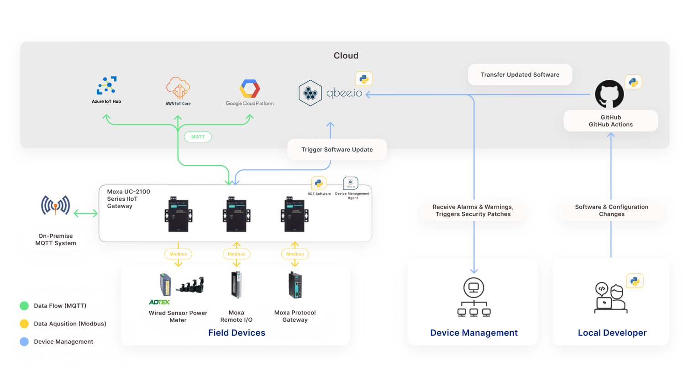

# Industrial IoT on a shoestring -Solution Architecture (Python)

# Getting Started
-	Apply now and win Free IIoT shoestring starterkit: https://pages.moxa.com/eu-uc-2100-giveaway-EN.html?utm_medium=website&utm_source=github&utm_campaign=2022-05-MEU-EN-UC-2100-Campaign

-	Application Note: https://pages.moxa.com/eu-uc-2100-application-note-gated-EN.html?utm_medium=website&utm_source=github&utm_campaign=2022-05-MEU-EN-UC-2100-Campaign

-	Webinar Recording: https://vimeo.com/713744866

- Moxa and Qbee IIoT Partner Profile: https://moxa-europe.com/partner/qbee/

# How to deploy software from Git repository to Moxa UC-2100 using CI/CD pipeline

## Prequisites: 
1- Device is connected to Qbee Account
2- Github account 
3- UC-2100 or any other UC series embedded computer  

### 1) Create qbee account
How to create see here: https://www.app.qbee.io/#/register?regtype=trial

### 2) Register UC-2100 on qbee account

### 3) Generate bootstrap key

### 4) Install qbee agent on UC-2100 
How to install see here: https://qbee.io/docs/qbee-install-agent.html

Login into Moxa UC-2100 computer via serial or LAN interface. Make sure UC-2100 has internet access. 
You can check by ping 8.8.8.8 or ping google.com 

sudo wget https://cdn.qbee.io/software/qbee-agent/qbee-agent_1.2.1_armhf.deb
sudo dpkg -i qbee-agent_1.2.1_armhf.deb
sudo /opt/qbee/bin/qbee-bootstrap -k ENTER-BOOTSTRAP-KEY-HERE

### 5) Confirm status of the UC-2100 

### 6) Create a new fork repository
https://github.com/MEUIIOT/moxaiiot-uc2100-qbee-io

A fork is a copy of a repository. Forking a repository allows you to freely experiment with changes without affecting the original project.
How to fork see here: https://docs.github.com/en/get-started/quickstart/fork-a-repo

### 7) Connect Github to your Qbee account
Copy the Group ID into notepad

Configure secrets on Github forked repository 

